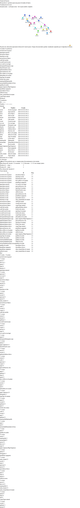

# ComercioConecta

Microproducto de **red producto↔producto** para una pyme que agrupa tiendas de barrio.
Analista registra productos y co-compras; encargado consulta la red.

Proyecto semestral (brief: `07-brief-comercioconecta.md`, reglas: `03-guia-comun-estudiantes.md`).



## Estructura del repo

```
.
├── backend/     FastAPI + grafo propio + SQLite (sqlite3 crudo)
├── frontend/    Vite + React + TypeScript + Tailwind
├── docs/        Decisiones de diseño, bitácora IA, guión de pitch
├── .github/     Template de PR
├── PLAN-F1.md   Seguimiento de tareas de la Feature 1
└── README.md    Este archivo
```

## Requisitos

- Python **3.12+** (verificado 3.14.4)
- Node **20+** y npm
- Git

## Correr en local

### Backend

```powershell
cd backend
python -m venv .venv
.\.venv\Scripts\Activate.ps1
pip install -r requirements.txt
uvicorn app.main:app --reload
```

- API: http://localhost:8000
- Docs OpenAPI (Swagger): http://localhost:8000/docs
- Health: http://localhost:8000/health → `{status, nodes, edges}`

Al **primer arranque** se carga automáticamente el seed de `backend/data/seed.sql` (25 productos + 41 relaciones). Arranques posteriores respetan los datos existentes.

### Frontend

```powershell
cd frontend
npm install
npm run dev
```

- UI: http://localhost:5173 (si está ocupado, Vite salta a 5174)

El dashboard muestra tres paneles (Productos / Relaciones / Red) que se refrescan en conjunto ante cualquier mutación.

## Endpoints

| Método | Path | Body / Params | Resultado |
|---|---|---|---|
| `GET` | `/health` | — | `{status, nodes, edges}` |
| `GET` | `/products` | — | Lista de productos ordenados por id |
| `GET` | `/products/{id}` | — | Producto o `404` |
| `POST` | `/products` | `{id, name}` | `201` o `409` (duplicado) / `422` (formato) |
| `GET` | `/relations` | — | Lista de relaciones (ordenadas, normalizadas `a<b`) |
| `POST` | `/relations` | `{a, b, weight?}` | `201` / `404` (nodo falta — detalle dice cuál) / `409` (duplicada) / `422` (peso≤0, self-loop, formato) |
| `GET` | `/network` | — | `{nodes:[{id,name}], edges:[{a,b,weight}]}` |

Documentación interactiva en http://localhost:8000/docs (Swagger auto-generado por FastAPI).

## Pruebas de aceptación

Script autosuficiente que levanta su propio `uvicorn` contra una DB temporal y corre **24 asserts**:

```powershell
cd backend
.\.venv\Scripts\Activate.ps1
python scripts\acceptance.py
```

Cubre todo lo que exige la guía: escenario normal, grafo vacío, nodo inexistente, relación inexistente, datos inválidos (duplicados, pesos inválidos, formato). "Ciclo" no aplica porque el grafo es **no dirigido** (ver `docs/decisiones.md`).

Imprime `ESCENARIO / ESPERADO / OBTENIDO / PASS|FAIL` por caso y termina con `exit(1)` si algo falla.

## Decisiones clave de diseño

Resumen (detalle en `docs/decisiones.md`):

- **Grafo propio** (lista de adyacencia), **no dirigido**, con **pesos opcionales** (default `1.0`, validación `> 0`). NetworkX prohibido para algoritmos (regla de la guía).
- **Persistencia**: SQLite con el módulo estándar `sqlite3` (sin ORM). El grafo vive en RAM y se **hidrata** al startup. Cada mutación se sincroniza SQL↔RAM.
- **Normalización** `a < b` en relaciones: evita duplicados simétricos (`(x,y)` vs `(y,x)`) a nivel DB. El grafo guarda la arista en ambos sentidos.
- **Errores de dominio** (`NodeMissing`, `EdgeExists`, etc.) se mapean a HTTP vía un exception handler único → routers sin try/except.

## Equipo

- **Juan David Builes Ochoa** — Core & datos (clase `Graph`, repository SQLite, seed, aceptación)
- **Fabian Alfonso** — Frontend inicial (React + TypeScript + Tailwind + 3 paneles)
- **Cristian Cardona** — Mejora del frontend (visualización interactiva con react-force-graph-2d)

Ver `PLAN-F1.md` para el reparto detallado de las 24 tareas y `docs/pitch-f1.md` para el guión de la demo.
